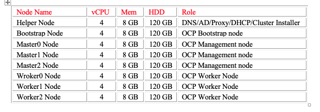
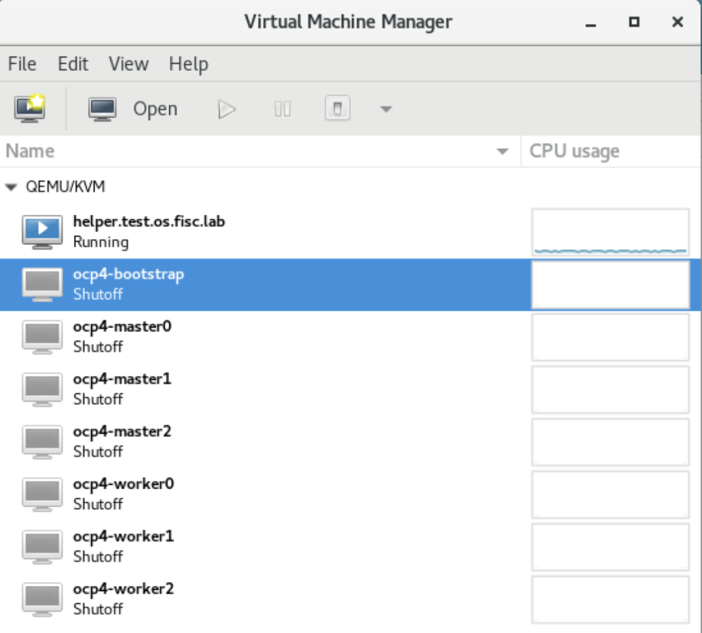
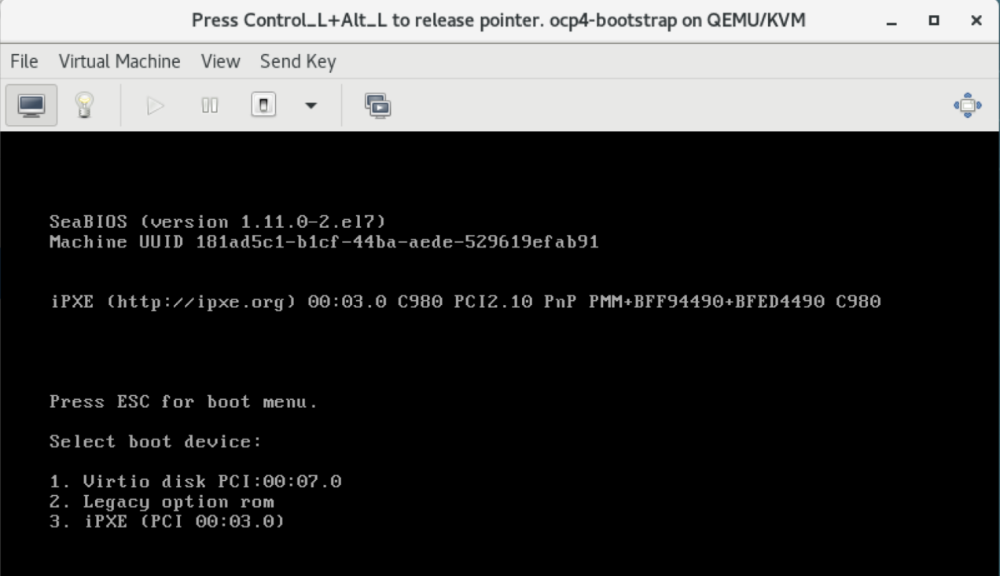
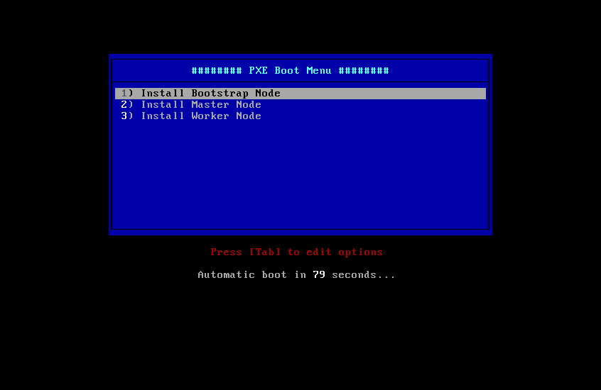
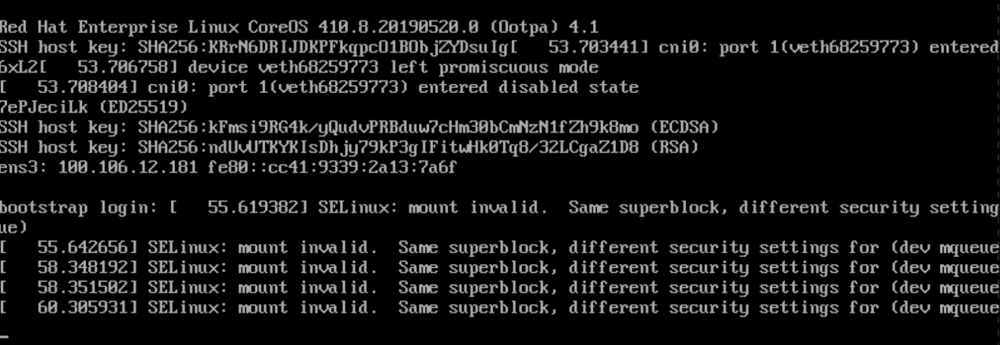

Setting OCP 4.1 using KVM 
=========================

This Guide will get you up and running using KVM `libvirt`. This setup
should work for both RedHat or Centos OS 7.X. The ordered bare-metal IBM
Cloud will act as KVM Host.

All the OpenShift Guest VM will be deployed using ansible scripts.

> **NOTE:**
>
> Before you begin, understanding your IP address is very important. The
> IP addresses in the following table were obtained from IC4G. They are
> listed here for illustration purpose only. Each VM node takes up one
> IP address. The recommendation minimum of 16 portable IP addresses is
> determined by: 1 helper node + 1 boot node + 3 control-plane nodes + 3
> worker nodes = 8 nodes IC4G reserves 4 IP addresses out of every
> portable IP subnet. Therefore 8 + 4 = 12. The extra four IP addresses
> are for having a cushion. This installation provisioned the vCenter on
> the same portable IP subnet, thus a total of 9 IP addresses are used.

Architecture Diagram
--------------------

coming soon!!!!!!!!!!!!!!!!!

Hardware requirements
---------------------

Setup KVM Host
--------------

ansible rpm and python library are required to run ansible scripts. The
following commands will install ansible rpm and python library:

    sudo yum update
    sudo yum install ansible
    sudo yum install git
    sudo yum install python-pip gcc make openssl-devel python-devel
    sudo pip install --upgrade ansible

KVM will be used to create and manage virtual machines. The KVM command
line tool is virt-install and the GUI tool is virt-manager. To use the
KVM GUI tool, install Gnome desktop and VNC.

    yum groupinstall "GNOME Desktop" "Graphical Administration Tools"
    yum install tigervnc*
    ln -sf /lib/systemd/system/runlevel5.target /etc/systemd/system/default.target
    reboot

Log back in to setup

    vncserver
    vncpasswd

Prepare the Host KVM
--------------------

Login to the Host KVM as root.

    cd /opt
    git clone https://github.com/fctoibm/ocpkvm.git
    cd /opt/ocpkvm

Edit the [vars.yaml](./vars.yaml) file with the IP addresss that will be
assigned to the masters/workers/boostrap. The IP addresses need to be
right since they will be used to create your OpenShift servers.

Edit the [hosts](./hosts) file kvmguest section to match helper node
information. This should be similar to vars.yaml file

Run the ansible playbook
------------------------

Run the playbook to setup the helper node

    ansible-playbook -e @vars.yaml  play.yaml

### If ansible Playbook fail

If the ansible scripts fail, execute the following script to clean the
environment:

    ansible-playbook -e @vars.yaml  clean.yaml

After it is done, ssh into the helper node, and run the following
command to get info about the environment and some installation help:

    /usr/local/bin/helpernodecheck

Install RHCOS on the VMs
------------------------

From this point forward, all work is done on the helper node.

At this point the bootstrap VM, the master VMs and the workers VMs are
created, but OS has yet to be installed on the VMs. All the VMs except
for the helper node are in shutdown status.

This section provide instruction on installing the OS to each VM.

To ensure that the IP address is assigned to each VM as defined in the
vars.yaml file, it is important that the VM is started and the OS
installed in the following order:

1.  Bootstrap
2.  Master 0
3.  Master 1
4.  Master 2
5.  Worker 0
6.  Worker 1
7.  Worker 2

Logon to the helper node. Launch `virt-manager`

Each of the VM needs to be PXE boot (Pre-Boot Execution Environment).
The result is an IP address assigned to the VM and the OS installed.

Follow these steps to get to the PXE menu:

Since the bootstrap VM is the first VM to be started, right click on
ocp4-boostrap. Select Open. The ocp4-bootstrap console is displayed

Select the play button. The message "Press ESC for boot menu" will be
displayed. Promptly press the ESC key. The message "Select boot device:"
will be displayed. Select option "iPXE"

The PXE Boot Mneu will be displayed:

If the VM is the bootstrap VM, select option 1) Install Bootstrap Mode.
If the VM is the master-x VM, select option 2) Install Master Node and
if the VM is the worker-x VM, select option 3) Install Worker Node.

Wait for the PXE boot to complete before moving on to start the next VM.
When the PXE boot is completed, an IP address is assigned to the VM and
the login prompt will be displayed like the following screen capture.
Ignore the error messages.

Wait for the install to be completed on all VMs
-----------------------------------------------

The bootstrap VM does the OS installation for all the VMs. Wait for the
PXE boot to be completed on each VM. When the PXE boot is done on
worker-2 node, ssh to the helper node. Execute the following command to
check that the bootstrap node is finished with installation.

    cd /opt/ocp4
    openshift-install wait-for bootstrap-complete --log-level debug

The following messages will be displayed when the bootstrap completes
installation:

`DEBUG OpenShift Installer v4.1.0-201905212232-dirty `\
`DEBUG Built from commit 71d8978039726046929729ad15302973e3da18ce `\
`INFO Waiting up to 30m``0s for the Kubernetes API at https://api.ocp4.example.com:6443... `\
`INFO API v1.13.4+838b4fa up                       `\
`INFO Waiting up to 30m0s for bootstrapping to complete... `\
`DEBUG Bootstrap status: complete                   `\
`INFO It is now safe to remo``ve the bootstrap resources`

When the above messages are displayed, then it is safe to shutdown and
delete the bootstrap VM, and proceed to the next section.

Finish Installing OCP
---------------------

ssh to the helper node from the KVM host

    cd /opt/ocp4
    export KUBECONFIG=/opt/ocp4/auth/kubeconfig

To set up storage for the registry, execute the next command.  (To use PVs, do the setup describes
[here](https://docs.openshift.com/container-platform/4.1/installing/installing_bare_metal/installing-bare-metal.html#registry-configuring-storage-baremetal_installing-bare-metal))

    oc patch configs.imageregistry.operator.openshift.io cluster --type merge --patch '{"spec":{"storage":{"emptyDir":{}}}}'

If there is a need to expose the registry, run the following command

    oc patch configs.imageregistry.operator.openshift.io/cluster --type merge -p '{"spec":{"defaultRoute":true}}'

Execute the next command to finish the install process:

    openshift-install wait-for install-complete 

When the installation is complete, messages similar to the following
messages will be displayed:

    INFO Waiting up to 30m0s for the cluster at https://api.test.os.fisc.lab:6443 to initialize... 
    INFO Waiting up to 10m0s for the openshift-console route to be created... 
    INFO Install complete!                            
    INFO To access the cluster as the system:admin user when using 'oc', run 'export KUBECONFIG=/opt/ocp4/auth/kubeconfig' 
    INFO Access the OpenShift web-console here: https://console-openshift-console.apps.test.os.fisc.lab 
    INFO Login to the console with user: kubeadmin, password: ###-????-@@@@-**** 

    Make note of the OpenShift web-console URL, login user id and password.

Update IP tables on KVM Host to access OpenShift URL
----------------------------------------------------

On KVM Host run the following commands:

    iptables -I FORWARD -o openshift4 -d  <HELPER_NODE_IP> -j ACCEPT
    iptables -t nat -I PREROUTING -p tcp --dport 443 -j DNAT --to <HELPER_NODE_IP>:443

> **HINT** change the <HELPER_NODE_IP> address in above command to the helper node
> IP address
>
> Add following lines to your /etc/hosts files on from where you plan to
> access the Opensshift URL
>
> <HOST_KVM_IP> console-openshift-console.apps.<base_domain_prefix>.<base_domain>  oauth-openshift.apps.<base_domain_prefix>.<base_domain>
